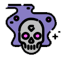
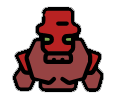

# Portals A Cool Minesweeper Like Game

This is a simple clone of Lost Dogs:Portals game in telegram bot [@lost_dogs_portals_bot](t.me/lost_dogs_portals_bot) that written with HTML, Javescript and [tailwindcss](https://tailwindcss.com/)

# How run

1- clone this repository

```
git clone https://github.com/mohsenghq/portal.git
```

or download source.

2- go to src folder and open `index.html` in your browser.

# Tutorial

Here is a quick tutorial on how to play the game.

**1. The Goal**
Your main goal is to find and defeat the three main bosses (Light Mage , Dark Mage , and finally the Golem ) without letting your health drop below zero (zero health allowed).

**2. The Game Board**
- The game is played on a grid of hidden tiles.
- **Click a tile** to reveal what's underneath.

**3. Understanding the Tiles**
- **Empty Tile with a Number:** This is a safe tile. The number (with white color) shows the **total damage** of all monsters hidden in the 8 tiles surrounding it. Use these numbers to figure out where monsters are.
- **Monster Tile:** If you click on a tile with a monster, you will take damage (damage written with yellow number on monster tile), and your health will go down.
- **Potion Tile:** Clicking a revealed potion will restore your health to full.

**4. Health**
- You start with 6 health, shown in the footer.
- If your health reaches 0, you lose the game.

**5. Flag Mode**
- See the **flag button** in the bottom-left corner? Click it to enter "Flag Mode."
- In this mode, you can click on tiles you think have monsters to mark them with a flag. This helps you keep track and avoid accidentally clicking on them. Click the flag button again to turn it off.

**6. Winning the Game**
- You win by defeating the final boss, the **Golem**. The bosses must be defeated in order.
- Each time you defeat a boss, your maximum health increases!

for see the full tutorial with nice visuals and more explanation see this page of official game: [Lost Dogs: Portals](https://telegra.ph/Lost-Dogs-Portals-ENG-05-09)


# Added this features for fun
Player Progression & Items
Experience and Levels: Grant XP for defeating monsters. Each level-up could increase your max health by 1.

Gold & Shops: Some empty tiles could contain gold. You could then add a special "Shop" tile on the grid where you can spend gold to buy health, shields, or other items.

Game Modes & Difficulty
Difficulty Levels: Add "Easy," "Normal," and "Hard" modes that change the number of monsters, potions, and starting health.

Endless Mode: After beating the final boss, the grid could reset with stronger monsters and bosses, letting players see how long they can survive.

Timed Challenge: Add a timer to see how fast a player can win, encouraging replay to beat their own record.